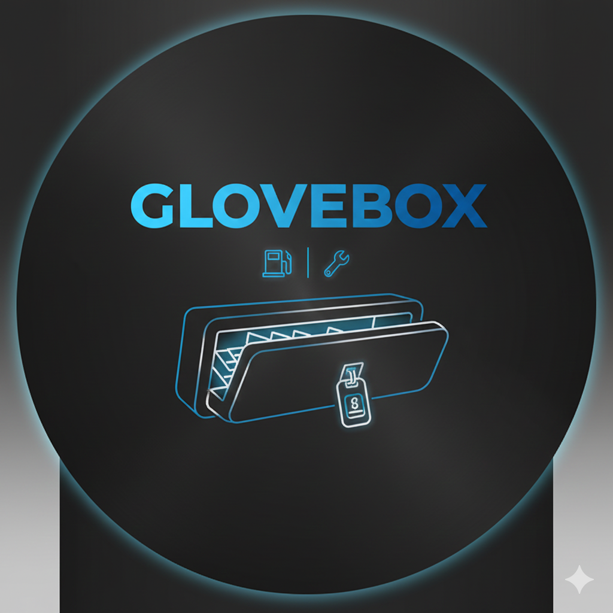

  

<h1 align="center">GloveBox</h1>

  <strong>Your digital glove compartment.</strong> 
  Track fuel, maintenance, and vital documents in one high-performance app.

---

## 🚀 Alpha Test v0.1.0
Welcome to the first alpha build! This version focuses on the core features needed to manage your car's health on the go.

### 📍 Alpha Roadmap
- [x] **Fuel Log**: Complete with MPG calculations and cost tracking.
- [x] **Maintenance Status**: Live countdown bars for Oil and Tire changes.
- [x] **Internal Service Log**: Dedicated screen to record every wrench turn.
- [x] **Vehicle Specs**: Custom internal vault for engine and parts data.
- [x] **Condition Record**: 6-photo grid (Camera & Gallery support).
- [x] **Document Wallet**: Digital storage for Insurance, Registration, and AAA.
- [x] **One-Touch Links**: Maps (Repair search), Manual, and Carfax integration.

---

## 📥 Installation (Alpha Testers)
1. Go to the [**Releases**](https://github.com/grumpy-gaming/glovebox/releases/latest) page.
2. Download the `app-release.apk` file.
3. Open the file. If prompted, allow "Install from unknown sources" for your browser.
4. Launch **GloveBox** and start logging!

---

## 🐞 Bugs & Suggestions
This is an alpha, so things might break! Your feedback is what makes the app better.

### How to report a bug:
1. Navigate to the **[Issues](https://github.com/grumpy-gaming/glovebox/issues)** tab in this repo.
2. Click **New Issue**.
3. Describe what happened and what you expected to see. 
4. **Note:** Please include your Android version (e.g., Android 15) and if you were using the Camera or Gallery when the error occurred.

### Suggestions:
Have an idea for a new feature? Start a new issue and label it as `enhancement`. I'm looking for ideas for the "Replace Vehicle" logic!

---

Built with ❤️ for the Gearhead Community

